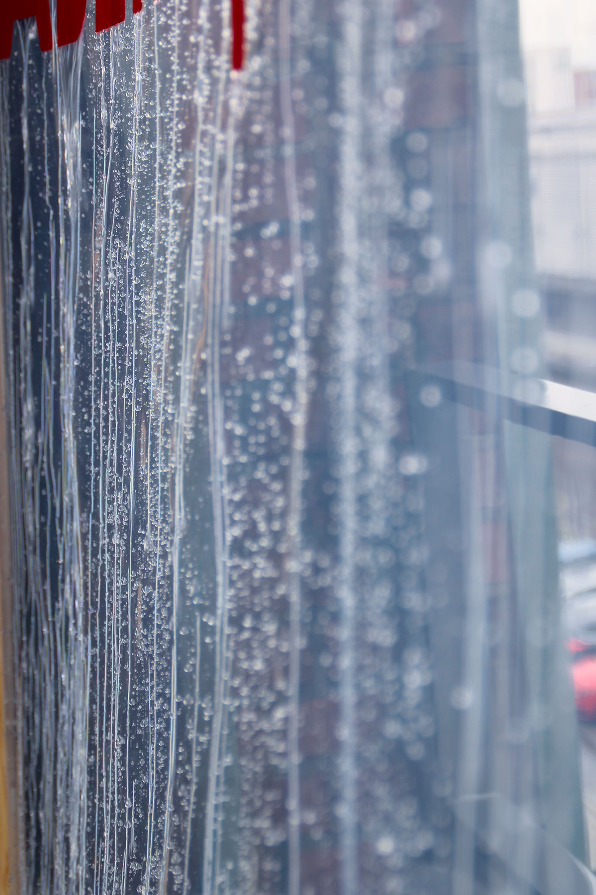
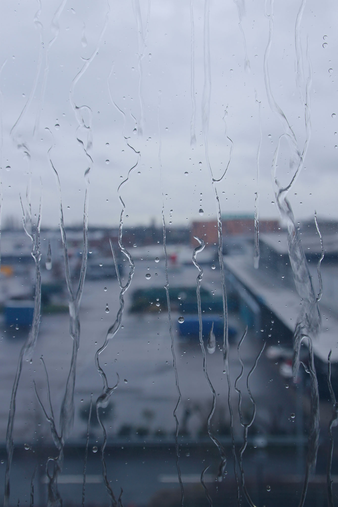

# Schietwettermaschine

2017, in collaboration with Lukas Leck

The *Schietwettermaschine* (~ shit-weather-maschine) is a simulation of typical Bremen weather: Rain. The installation was part of a concept store that showcased Bremen in various ways and tied to deliver a authentic impression of the city to the visitor.

<audio src="Rain.wav" autoplay controls="controls" loop="true">
  The installation features an auditive experience. The track cannot be played back in your browser.
</audio>

*CONCEPTUAL IDEA*

*CONSTRUCITON*

The work was exhibited at Hochschultage at University of the Arts in Bremen on 11. & 12. of February 2017.

#installation