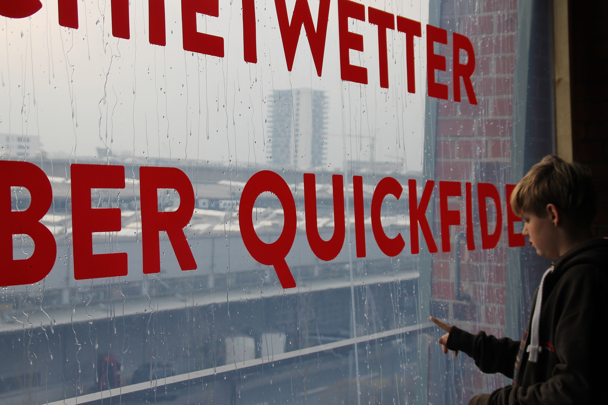
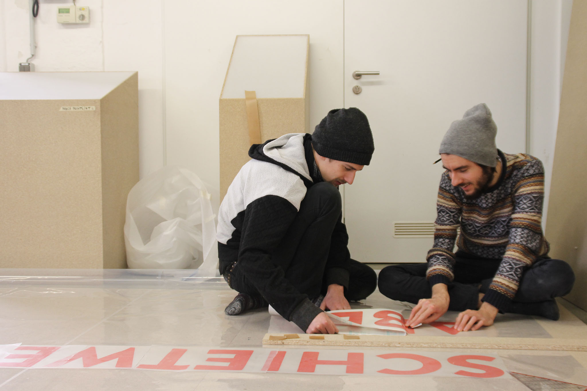
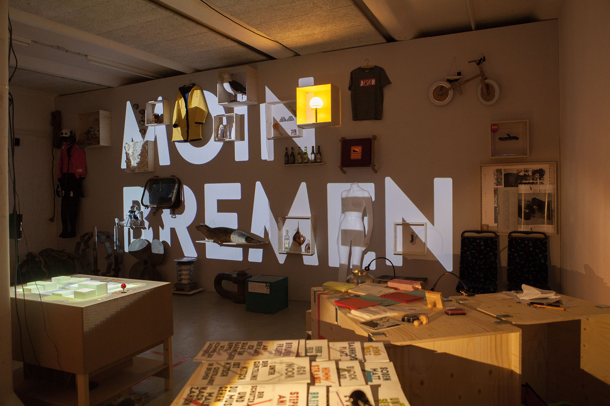

# Schietwettermaschine

2017, in collaboration with [Lukas Leck](http://lukasleck.work)

The *Schietwettermaschine* (~ shit-weather-maschine) is a simulation of the typical weather in the city of Bremen: Rain. The installation was part of a exhibition design project that resulted in a concept store that showcased Bremen in various ways and tied to deliver a multimedial impression the city to a visitor.

The work was exhibited at Hochschultage at University of the Arts in Bremen on 11. & 12. of February 2017. The concept store was situated at the 6th segment of Speicher XI in the 3rd floor. The installation took place inside the elevator and on the balcony in front of the store.

The elevator ride up to the 3rd floor was augmented by an audio experience. Two Speakers were mounted into the elevator, driven by an off-grid 12V system, on which a composition of rain-sounds, as if heard from inside the elevator, was playing.

*The installation features an audio experience. As during the exhibition the soundtrack is played back and looped on this website. (wav, 1:46)*
<audio src="Rain.wav" autoplay controls="controls" loop="true">The track cannot be played back in your browser.</audio>

Once the visitors arrived on the third floor, the door opens and reveals the view on the second part of the installation. A window made out of highly-transparent foil was mounted on a wooden frame. A water pump was transporting the water from a reservoir through copper pipes to the top edge of the frame. Here it was released through tiny holes in the pipe and spilled onto the foil. The drops formed hundreds of tiny streams running down the foil. As the result the people, coming out of the elevator, were looking from the balcony on the neighbouring buildings through a curtain of rain.
"Schietwetter aber quickfidel"(~ "shitty weather, but lively") a slogan in local dialect, written on the window, was rounding off the image and welcoming the visitor to the Bremen experience waiting for them inside the store.

### Evaluation

Both parts of the project needed their good amount of preparation time. Doing both at the same time was challenging but ended up satisfying for us. Building up a water installation in the third floor, with found parts and parts from the hardware store, is of course an experiment, and likely to cause trouble. Thus we are happy that our construction turned out to be a working model, that caused no dangers during the two days of presentation. To reach this degree of temporary usability and sufficient safety, it took quite some tinkering and fine-tuning. The audible enactment of the elevator turned out much less tricky - originally we planned to trigger the sound with a sensor mounted on the elevators’ door, which rendered impossible due to sunlight compromising the IR sensors reliability. In the end we decided that the experience also works perfectly with the soundtrack looping continuously. All in all we were quite happy with the outcome of our installation and the pop-up store in general. We had a lot of positive feedback from the people passing by. We believe that our goal to turn the weather of Bremen into something attractive and enjoyable was reached.

