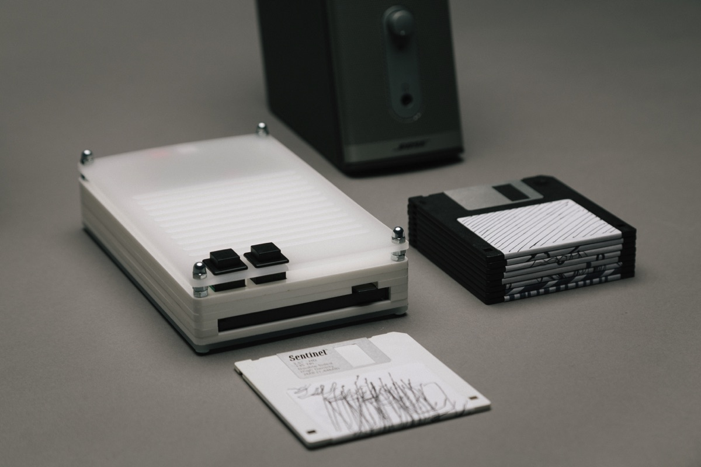
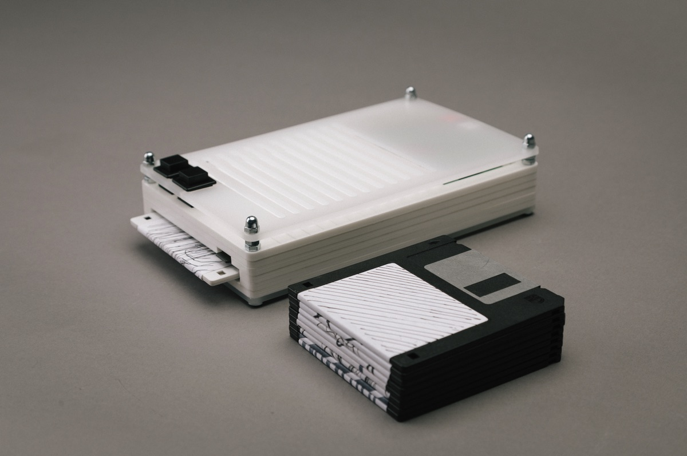
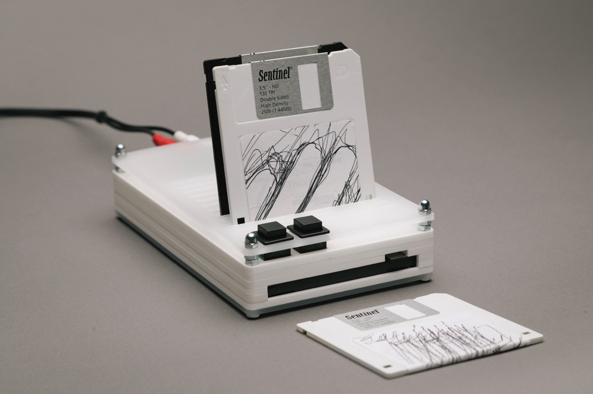
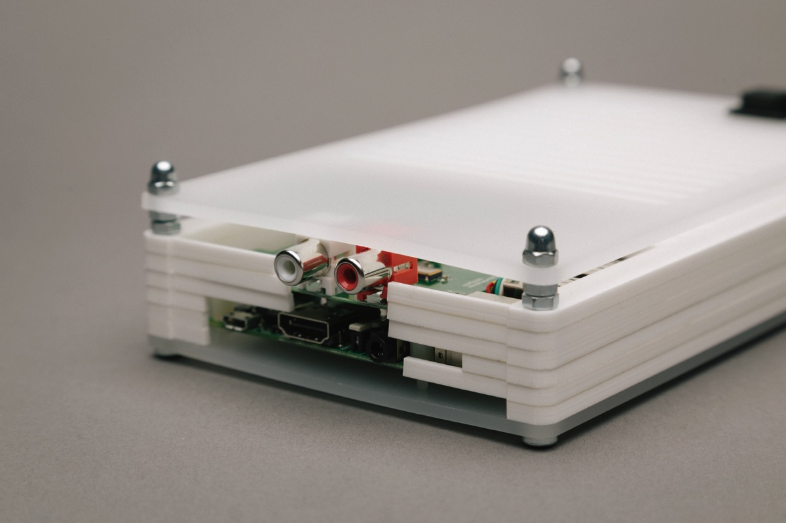

# tapedeck

2016

*tapedeck* investigates the interaction with physical tokens as artefacts for virtual entities. The device is a playback system of streaming music, that is controlled through a collection of 3,5" floppy disks.

*The project experiments with matters of materiality and virtuality. Playing with historic interaction of records and data, tapedeck reintroduces a haptic sense and affords a collection in the physical. Nonetheless at it`s core the device makes use of digital distribution and playback, touching the limitations of ownership, availability and expression.*

Todays music is often produced and consumed digitally end-to-end. Physical records that function as delivery, collectable and playback medium are a sign of the past. The availability of high-speed internet connectivity, delivery services and more connected playback devices shape todays listening experience. Collections are kept on computers and playback is arranged primarily via on-screen interactions.

*tapedeck* offers a alternative experience of collecting and listening to music. The internet-connected device can playback music from various online services (like Spotify and Soundcloud). 3,5" floppy discs function as physical pointers to the online music source. The playback interaction is entirely screen-less and offers just a minimal set of functions.

The front side affords two buttons and a slot to insert a floppy disk. When inserted, a third button allows the ejection the disk. The interaction is simple: Insert disk -> Playback starts.
The buttons allow to skip a track, or jump back to the previous one if the disk contains a set of tracks (i.e. a album or playlist).

The hardware consists of a Raspberry Pi (3rd generation), a HiFiBerry DAC+ audio interface and a standard USB floppy drive. Audio out is provided via RCA connectors.
Enclosing the inner parts, the device features a laser cut casing. Sketches of the design where prepared in Fusion 360 and then sliced for 5mm acrylic sheets. The sliced parts are connected by 4M screws. The top layer functions as a disk stand.

The Pi runs standard Raspbian with [Mopidy](https://www.mopidy.com/), a python audio server. Mopidy comes with interfaces / plugins for all popular streaming services, so it already did a lot of the work. Extended by a [custom frontend](http://github.com/jelko/tapedeck), the server also handles the interactions with the floppy drive, which is triggered by a simple `udev` rule.

