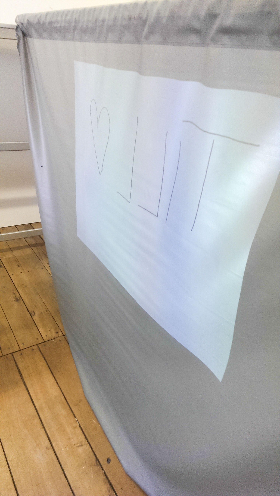
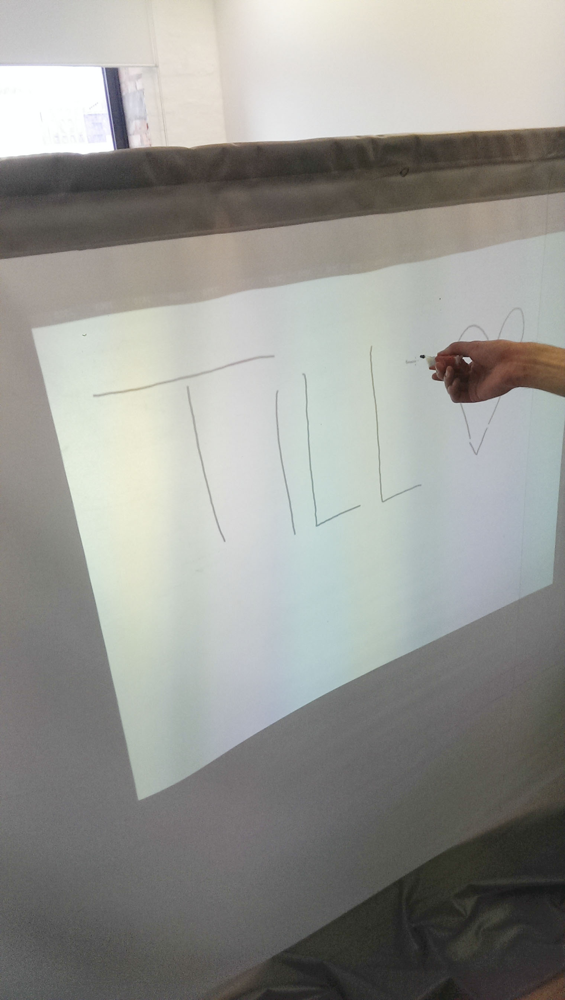
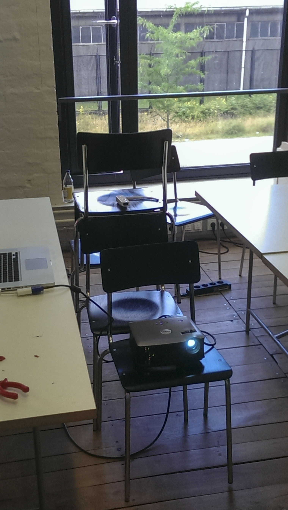

# The wall

Concept & Prototype for a interactive, anonymous communication plattform.

2014

What would happen if you could talk to somebody by drawing on a web-connected whiteboard? I tried to find out by building one. 

## Concept

The idea is quite simple: I wanted to build two (or more) whiteboards that are mirrored on each other. Users should be communicate with each other by drawing or leaving messages on the board.

## Using a Wii remote

After a little research I came accross the other projects building a digital whiteboard with infrared pens and sensors. A common solution was to use the remote of a Wii (game console) as an infrared camera. Luckily [someone awesome](http://uweschmidt.org/wiimote-whiteboard) had already build awesome software to translate the remote data into mouse movements and calibrate the input.

## Prototype

The board itself was build using a regular projector and a rear projection screen. After some testing I found out that the screen does allow infrared light to go through. This allowed me to let the user stand on one side of the construction and place the projection and sensor on the other side. I build a super-simple infrared pen as an input device.

## Connecting two boards

After I got my initial prototype working, I build a second one. With some basic Java and UDP networking I build a own drawing application. It allowed the user to draw using the infrared pen and see the result on screen. More importantly it sends the drawing across the network to the second display.

## What I did

* Concept
* Code
* Protoype

## Tools used

* Projector
* rear projection screen
* Wii Infrared Sensor
* WiimoteWhiteboard
* Java
* self-build infrared »pen«

This work was part of the class »Erlebniswelten« by Andrea Dilzer.