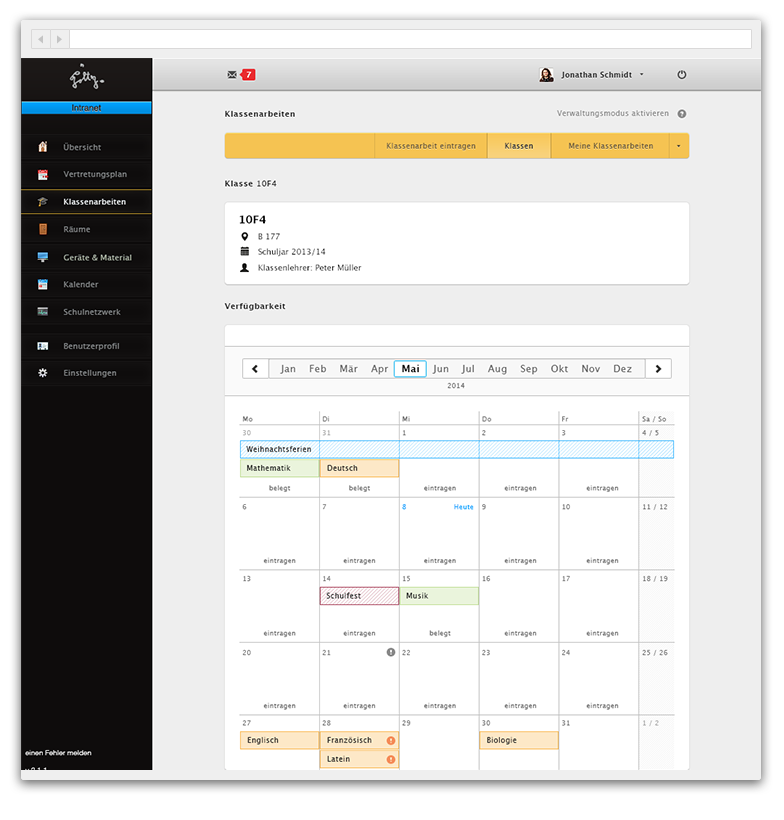
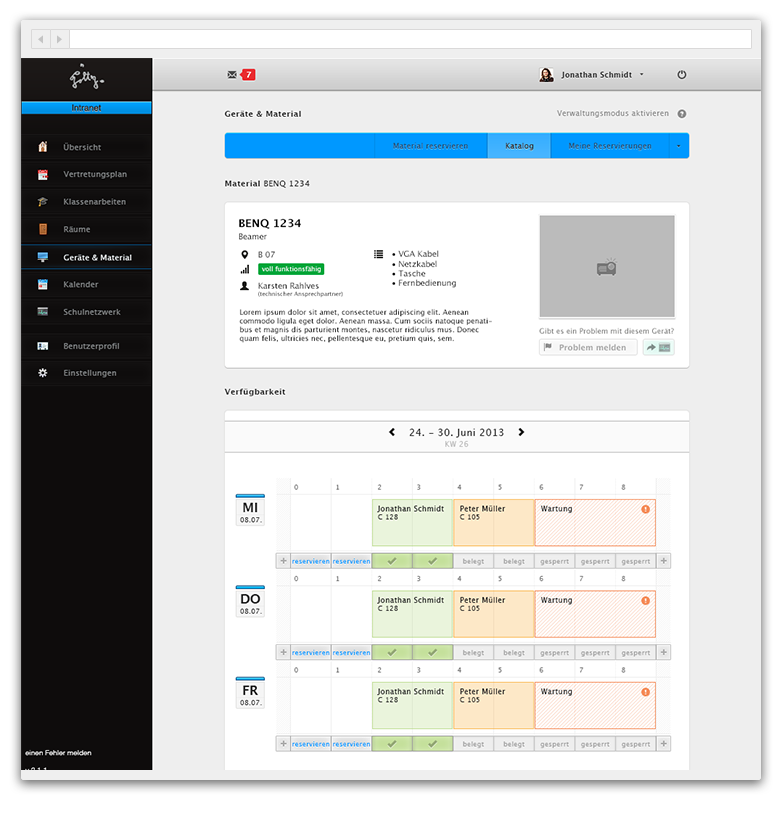
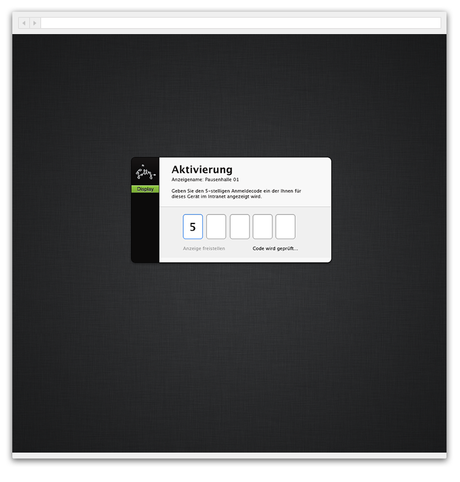

# Making school live easier

Design & Development of a web application that helps teachers to organize stuff at school.

2011 - 2013

This one was extensive! My old high school had a web application for internal communication and coordination between teachers. The old »Intranet« was technically unsupportable and buggy. I got asked to develop a new version of the application. I did. 

## UI Design

The UI design went through multiple iterations. Below you can see a one of the latest.

## Code & Functions

After a failed try with PHP, I quickly decided to build the entire application from the ground up with Django (which was new to me at the time). This turned out to be a very good decision.

I build the application in a modular approach. The developed modules are:

* Substitution timetable
* Exam management
* Room and device booking
* Calendar (with Exchange support)
* Remote display UI & Client for screens in the school building
* External Auth (with existing IT systems)
* The front-end was developed using HTML 5, CSS (with Bootstrap), JS (with jQuery).
* Later I built some of the interactive elements, for example * the calendar UI with Backbone.js and a own server-side API.

The remote display client was build as a HTML 5 app as well. We used LocalStorage to be able to display information even if the network is down.

The application got deployed on a nginx and gunicorn stack. It has arround 1500 active users.

## What I did

* UI design
* front-end development
* back-end development
* deployment

## Tools used

* Adobe Photoshop
* Django (Python Framework)
* Twitter Bootstrap
* Backbone.js
* jQuery
* and lots more